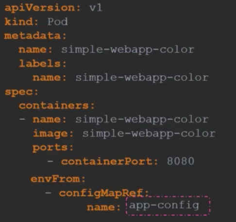

# Configurations
- We can configure the image to slepp on startup by changing its configuration: 

- The command here is to sleep on startup, and to sleep for 5000s on startup.  

### Working in a Dockerfile
- In a Dockerfile we can set an ENTRYPOINT with a command which will alway be executed on launch. All parameters that are given to docker run <image> are passed as arguments through the ENTRYPOINT. 

- Here, the Dockerfile has defined an ENTRYPOINT and the commands to be passed through it.
- In the YAML file we defined a command to overide the command used in the Dockerfile. 

## Environment variable
- We can set environment variables in the following way.

- Here, we use a key value pair. 

## Configure Maps
- We can create one for our key: value pairs in either an imperative or declarative way.
- They're useful for stroing and using configuration settings that containers need at runtime. 
- Imperative method:
`kubectl create configmap <config-name> --from-literal=<key>=<value>`
- Declartive:

- We can then apply this with: `kubectl apply -f my-config.yaml`

### configure it in a pod
- We can now configure the map to our pod:

## Secrets
They're used to store sensitive information, like passwords or keys. 
- Imperative method:
`kubectl create secret generic <name> --from-literal=<key>=<value>`
- Declaritive method:

- Here however, the passwords are visible which we don't want. We need to be able to encode the passwords. Instead of writing the passwords, we writ them in an encoded form:

- In order to generate the encoded passwords, we run the commands:
`echo -n 'mysql' | base64`
`echo -n 'root' | base64`
`echo -n 'paswrd' | base64`
- To view our created secrets, we run the command:
`kubectl get secrets`
- In order to decode, we can use the command:
`echo -n 'bX1zcWw' |base64 --decode`

- We can make the data in the secret file available in a pod as an environment variable by doing: 

- Note: This isn't that safe, as it can quite easily be decoded.