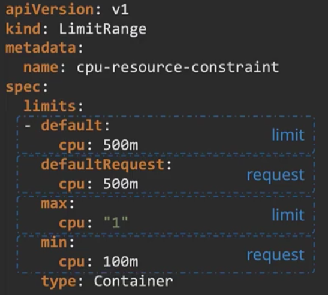

# Configurations
- We can configure the image to slepp on startup by changing its configuration: 


- The command here is to sleep on startup, and to sleep for 5000s on startup.  

### Working in a Dockerfile
- In a Dockerfile we can set an ENTRYPOINT with a command which will alway be executed on launch. All parameters that are given to docker run <image> are passed as arguments through the ENTRYPOINT. 

- Here, the Dockerfile has defined an ENTRYPOINT and the commands to be passed through it.
- In the YAML file we defined a command to overide the command used in the Dockerfile. 

## Environment variable
- We can set environment variables in the following way.


- Here, we use a key value pair. 

## Configure Maps
- We can create one for our key: value pairs in either an imperative or declarative way.
- They're useful for stroing and using configuration settings that containers need at runtime. 
- Imperative method:
`kubectl create configmap <config-name> --from-literal=<key>=<value>`
- Declartive:


- We can then apply this with: `kubectl apply -f my-config.yaml`

### configure it in a pod
- We can now configure the map to our pod:


## Secrets
They're used to store sensitive information, like passwords or keys. 
- Imperative method:
`kubectl create secret generic <name> --from-literal=<key>=<value>`
- Declaritive method:


- Here however, the passwords are visible which we don't want. We need to be able to encode the passwords. Instead of writing the passwords, we writ them in an encoded form:


- In order to generate the encoded passwords, we run the commands:
    - `echo -n 'mysql' | base64`
    - `echo -n 'root' | base64`
    - `echo -n 'paswrd' | base64`
- To view our created secrets, we run the command:
`kubectl get secrets`
- In order to decode, we can use the command:
`echo -n 'bX1zcWw' |base64 --decode`

- We can make the data in the secret file available in a pod as an environment variable by doing: 


- Note: This isn't that safe, as it can quite easily be decoded.

# Encrypting Secret data at rest
It refers to encrypting data while it's stored on a disk. This safeguards data should the storage system be compromised. The data at rest in the ETCD can be encrypted. 

- We can first check whether encryption is already enabled with the command:
`ps -aux | grep kube-api | grep "encryption-provider-config"`

### Creating the encryption
- We first need to create a 32-byte random key:
`head -c 32 /dev/urandom | base64`
- We can then add this to an encription YAML file:


- Next, we need to move the file to the local directory:
    - `mkdir /etc/kubernetes/enc`
    - `mv env.yaml /etc/kubernetes/enc`

- We next need to mainfest this into the kube-apiserver
`vim /etc/kubernetes/mainfests/kube-apiserver.yaml`
- We add the following to the file:
`--encryption-provider-config=/etc/kubernetes/enc/enc.yaml`


- Under volume mounts we add:
```
- name: enc
  mountPath: /etc/kubernetes/enc
  readonly: true
```


- Then under volumes we add:
```
- name: enc
  hostPath:
    path: /etc/kubernetes/enc
    type: Directory0rCreate
```


- We can then chack that this has configured by running the command:
`ps aux | grep kube-api | grep encry`

- We should see the following


- Now that we know that the encryption is enabled, we can test it. We can create a secret key: 
`kubectl create generic my-secret-3 --from-literal=key2=topsecret`

- We can now run the long command to check the status of the secret-key:
```
ETCDCTL_API=3 etcdctl \
   --cacert=/etc/kubernetes/pki/etcd/ca.crt  \
   --cert=/etc/kubernetes/pki/etcd/server.crt  \
   --key=/etc/kubernetes/pki/etcd/server.key  \
   get /registry/secrets/default/my-secret-2 | hexdump -C
```
- The output should look like: 


- We now can't see the key, so it is encrypted. 
- The guide can be found in the official documentation: https://v1-22.docs.kubernetes.io/docs/tasks/administer-cluster/encrypt-data/ 

# Change the user 
- When running a process, we may not want it to run as the root user. We can therefore specify who we want it to run as.
`docker run --user=1000 ubuntu sleep 3600`
- We are running as `user 1000`, and the image `ubuntu sleep 3600`.

## Security context
- We can add the actions to the pod.yaml file. We can either run it at the container or pod level. If we run it at the pod level, it will apply to all the containers within the pod. 
- To run it on the pod level we do:


- To run it on the container level:


# Service account
A service account is a type of account that's meant to be used by services (like pods), not users. It provides identity for processes that run in a pod. 
- we can create one using the command:
`kubectl create serviceaccount dashboard-sa`
- When you create the ServiceAccount, a token is also created. The token can be used for API authentication. It however is stored as a secret object. 
- We can view the token in the following way:


- This can then be used to authenticate a third party connection to the kubernetes API. 

- In every namespace, a default service account is created. If we create a simple pod, a volume with the token will be automatically attached.


- If we then describe the pod, we can see the volume token attached.


- This token is mounted at the location `/var/run/secrets/kubernetes.io/serviceaccount`
- If we go to this location and `ls` we will see the token added. 

### Add a different service account
- We can add a different service account to the pod if we want.


- Here, `dashboard-sa` is the service account we created. 

- Note: Since version 1.22, this type of secret is no longer used to mount credentials into pods , and obtaining tokens via the TokenRequest API is recommended instead of using service account token secret objects. They're more secure because they have a bounded lifetime and aren't readable by other API clients. 

# Resource requirements
We can set the amount of CPU usage and memory that we want a pod to have available. We can also set the maximum limit for pod as well. 


- We can also set a min request a container in a pod can make, and max limit of what can be set on a container. 



- We can also set hard limits within a namespace with quotas:

