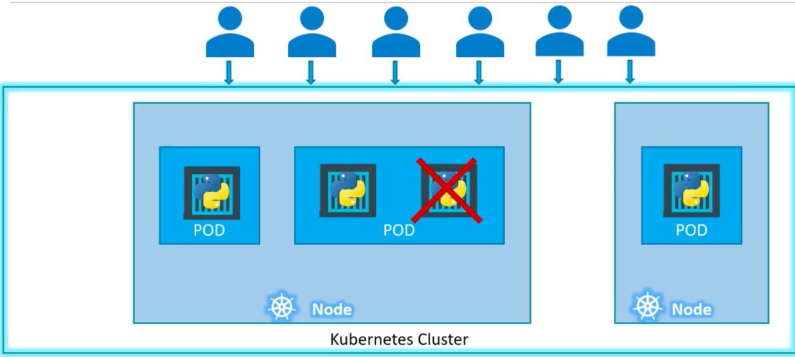
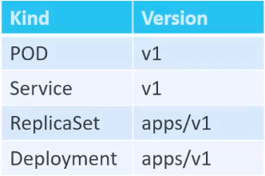
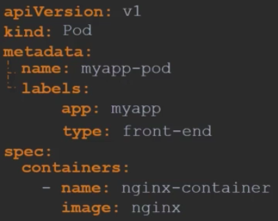
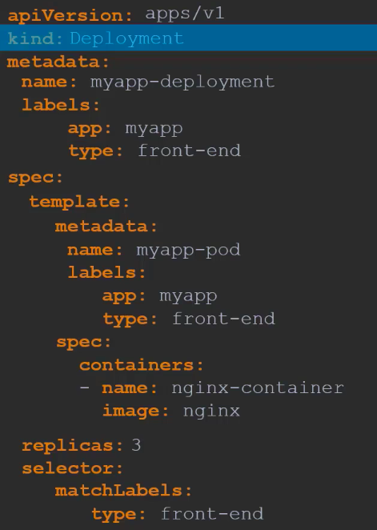
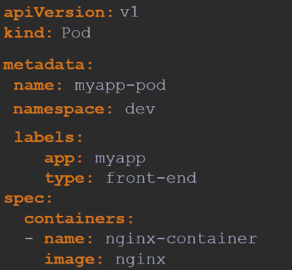
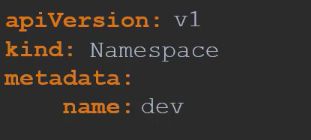
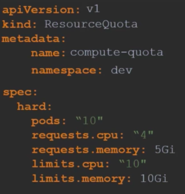

# Core concepts
## Nodes and clusters
- A node is a virtual machine which kubernetes is installed on. This i where pods can be launched. If one goes down, everything we're doing fails. We therfore need multiple nodes.
- A cluster is multiple nodes grouped together, so if one node fails, we still have others up and running. 
- The master node watches over the nodes in the cluster, and is responsible for the orchestration. 

## ETCD
It's a distributed key-value store that serves as the primary data store for storing and replicating critical cluster information. It provides the foundation for storing and accessing cluster configuration and state information in a distributed and highly available manner.
- Data storage: It stores cluster-wide configuration data, including network settings, authentication details and API server configuration.
- Consistency and reliability: It ensures data consistency and reliability.

## Kube-API Server
It acts as the primary interface for communication with the kubernetes cluster. It serves as the central control point for cluster administration, resource management and communication with other Kubernetes components.

## Kube controller manager
The controllers are things that control certain things on the clusters, such as managing the containers, the number of worker nodes etc. They continuously monitor the state of certain parts of cluster, and look to fix parts. There are controllers to manage replicas, deployment, enpoints namespace and more.

The controller manager has all of these controllers within it. When you install the controller manager, you get all of the individual controllers.

## Kube scheduler
It decides which pod goes to which node, it can filter nodes based on metrics such as CPU etc. and then it can rank nodes based on how much resources the node has. (A pod is a group of one or more containers that are scheduled and run together on a cluster) It essentially decides which node the pods go to.

## Kublet
It's the point of contact between other worker nodes and the master. Kubelets register nodes, create pods and monitors nodes and pods.

## Kube Pods
Pods are single instances of an application, one container instance per pod, they are the smallest object you can create in Kubernetes. You can deploy multiple pods inside a node or launch a new node and pod.

Theres usually a 1 to 1 ration of pod and container. To scale within a node, you add more pods. You can have multiple containers in a pod, however they're usually different containers.

## Kube proxy
Every pod can communicate with every other pod using an internal pod network over the cluster. A service is created so the pods can be accessed, this also gets an IP address assigned to it. Whenever a pod tries to access a service using its IP or name, it forwards the traffic to the backend pod.

It acts as a network proxy, providing a virtual IP address for each service and distributing traffic to the appropriate backend pods.

## Docker vs ContainerD
### Docker
Docker is a platform that provides a comprehensive set of tools and services for building, packaging and distributing containers. It includes Docker engine, which utilises ContainerD as its underlying runtime.
### ContainerD
It's an open source container runtime focused on core container functionality. It's designed to be lightweight, modular and easily embeddable into different container platforms and orchestration systems.

## Pods with YAML
- When writing a YAML file, we have several essential parts:
    - apiVersion: v1 (We have multiple versions)
    - kind: Pod (Again, we can have different kinds, like replicas)
    
    
    
    - metadata: (information about the object)
        - name: myapp-pod
        - labels:
            - app: myapp (key-value pair)
            - type: front-end
    - spec: (dictionary)
        - containers:
            - name: nginx-controller
            - image: nginx (docker image name)

## Replication controller
A replication controller can control pods over multiple nodes.
- In order to do this, do the following yaml file:

- Here, we're creating a replication controller. This allows us to create replicas of pods.
- The template that we are adding here is the metadata and spec for the individual pods for nginx.
- `kubectl get replicationcontroller` allows us to see the controller.

## Replica sets
Replicas allow for high availability where you state a number of pods to run, and then the replication controller can bring up new pods to meet the replica set if any go down.
- To create one, create a yaml file with the following:

- It's very similar to the replica controller.
- Here however, we added the selector at the bottom. This allows us to have the ReplicaSet look at existing pods with the provided label and see them as a replica. (We have given the label `type: front-end` to the nginx pod before)
- We can scale the ReplicaSet in a few ways:
    - `kubectl replace -f replicaset-definition.yaml`
    - `kubectl scale --replicas=6 -f replicaset-definition.yaml`
    - `kubectl scale --replicas=6 replicaset myapp-replicaset`
- We can inspect the replicaset with `kubectl describe replicaset`

## Deployment
We can deploy the application in multiple instances in different environments such as production, development etc. You can update changes or rollback in certain instances.Deployments are one level higher and can use replica sets and also control updates and changes.
- The file we use to run this is essentially the same as the ReplicaSet, however with the name changed.

- We then run the commnd `kubectl create -f deployment-definition.yaml`
- We then see this using `kubectl get deployments`
- The deployment automatically will create a ReplicaSet.
- `kubectl get all` shows everything created.
- We can generate a YAML deployment file with `kubectl create deployment --image=nginx nginx --replicas=4 --dry-run=client -o yaml > file-name.yaml`

## Namespaces
Namespaces help to isolate resources such as having a 'Dev' namespace, for example, so you do not accidentally modify resources in Production.In each Namespace, resources communicate with each other using their names such as 'db-service'. For a resource outside of the namespace to connect, it needs to append the name of the namespace e.g. 'db-service.dev.svc.cluster.local'. Different permissions can also be set in different namespaces.
- When we create a pod normally, it's created in the dafault namespace.
- However, we can create it in a different namespace, for example: `kubectl create -f pod-definition.yaml --namespace=dev`
- We could also instead move the namespace into the file.

### Create a new namespace
We can create a simple YAML file to do so.

- We can then run: `kubectl create -f namespace-dev.yaml`
- Or we could create one by running: `kubectl create namespace dev`. This creates a `dev` namespace.

## Switching between namespaces
- We can view pods in different namespaces by: `kubectl get pods --namespace=dev`
- To switch the dafault to a different namespace, we can run: `kubectl config set-context $(kubectl config current-context) --namespace=dev`
- To view pods in all namespaces, use: `kubectl get pods --all-namespaces`

## Limiting resources in a namespace
- We can limit the amount of resources in a namespace by running the following file:

- In here we can specify the specific namespace, and then the limits under `spec`.