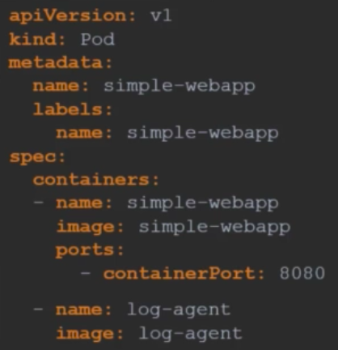
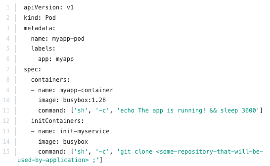

# Multi-container
Inside one, you can have multiple containers in the same pod. Inside a multi-container pod, all containers share the same network namespace, including the IP address and network ports, and can communicate with each other using localhost. They can also share the storage volumes.
- It can look like this:

- Here, the containers can be changed at required.

## Init containers
In a multi-container pod, each container is expected to run a process that stays alive as long as the POD's lifecycle. The process running in the log agent container is expected to stay alive as long as the web application is running. If any of them fails, the POD restarts.

But at times you may want to run a process that runs to completion in a container. For example a process that pulls a code or binary from a repository that will be used by the main web application. That is a task that will be run only one time when the pod is first created. That's where initContainers comes in.

