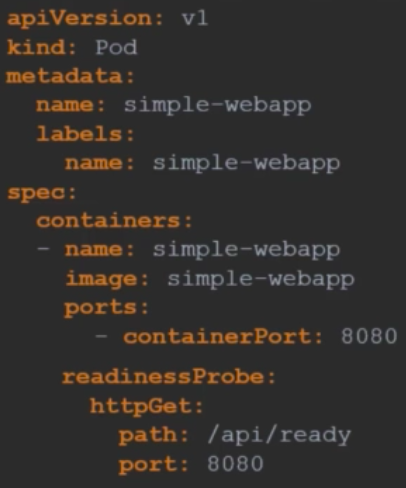
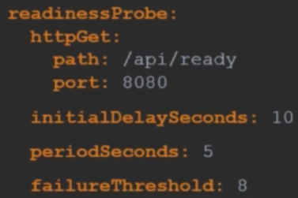
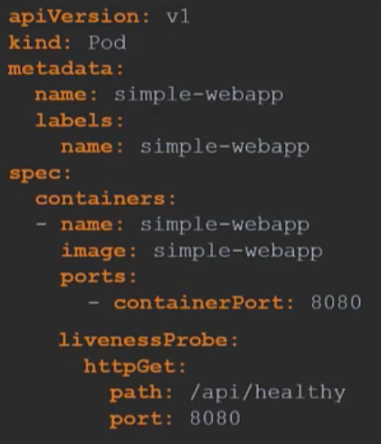
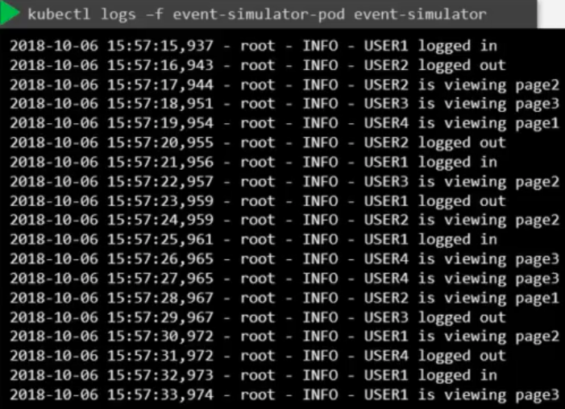

# Readiness and liveness probes
Kubernetes assumes that once the pod is created, it's ready to serve user traffic. However, even if kubernetes shows a pod as running, it may not be available to users yet. Therefore, traffic may be directed to a pod that isn't actually yet running. We can run tests within the pod definition file to correct this. 

- Here, we added an API request to the file. The pod will only show as ready once it completes the API request. 
- We can do this for TCP and Execute command as well. 
- We can also add an initial delay and a period for how often it will be checked.
- After 3 failed checks, it will automatically stop, so we can also add additional checks. 

## Liveness probes
- If a probe fails, kubernetes will attempt to restart it. We could end up with a repeatin loop if it continues to fail
- We could also have a probe that has a bug in it, and that appears to be working for kubernetes, but isn't working for the end user. 

We can test for this in a similar way in which we did before by defining the test in the pod definition file: 

# Container logging
We are able to view the logs of the container running within a pod. They are the text records of events and messages that occur while the application in the container is running. If we have multiple containers in one pod, we must specify which container log we want to view.

# Monitor and debug applications
We will discuss how to monitor things in kubernetes, like CPU utilisation. We will do this using the metrics server. The Kubelet agent on each node contains a cAdvisor. It is responsible for retrieving performance metrics, and exposing them through the Kublet API to make the metrics available to the metrics server. 
- We can deploy the metrics server from github by: `git clone https://github.com/kubernetes-incubator/metrics-serve` and then `kubectl create -f deploy/1.8+/`. 
- Once the performance has been processed, it can be viewed by running the command `kubectl top node` to give the readout for each node. 
- We can also run `kubectl top pod` to get a readout for specific pods. 