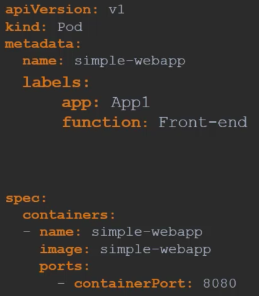

# Labels, selectors and annotations
We need a way to filter objects by using labels and selectors. 

- We can add as many labels to our pods as we want:

- To access this specific pod we can search: `kubectl get pods --selector app=App1`

- We can also add labels to a replica set: 

- At the top are the labels of the replica set, and at the bottom are the ones of the pods we are matching. 
- We can also add annotations for further details. 

# Rolling updats and rollbacks
When we make updates to our app and deploy them, we make a new revision. This helps us keep track of the changes, and roll back to previous changes if needed. 
- We can check the history with `kubectl rollout history <name>`

There's two types of deployment strategies:
- The first is to destroy the old replicas, then create newer ones. 
    - This however means there will be a down time during the period.
    - This is called the recreate method.
- The second is we take down the older version and deploy the new one one-by-one. This is a rolling update, and is the standard one we use. 

We can start by making a change to our application YAML file. This can then be applied using `kubectl apply -f <name>`, which automatically starts a rolling update. 

- To undo a change we have made, we can rollback with the command `kubectl rollout undo <deployment_name>`. 